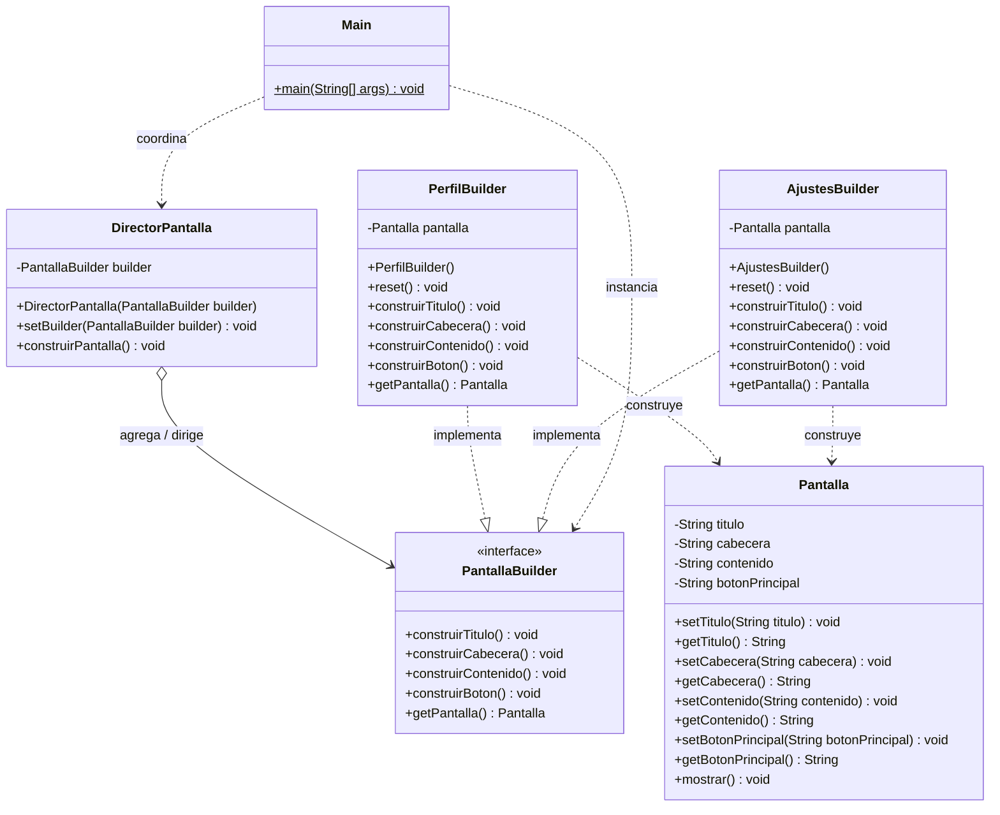

# Actividad: Patrón de Diseño Builder (GoF)

[](https://www.oracle.com/java/)
[-00599C?style=for-the-badge)](https://refactoring.guru/es/design-patterns/builder)
[](#)

Este repositorio contiene la implementación práctica y profesional del patrón de diseño creacional **Builder** (*Constructor*), siguiendo las directrices clásicas de la literatura del *Gang of Four* (GoF) en **Java**.

El proyecto simula la construcción desacoplada y guiada de interfaces de usuario (`Pantalla`), demostrando cómo un mismo proceso de ensamblado orquestado por un **Director** puede producir diferentes representaciones concretas (`Perfil` y `Ajustes`).

---

## 📐 Diagrama de Clases (UML)



---

## 🧩 Componentes del Patrón

El diseño se compone de las partes formales del patrón Builder:

### 1. Producto (`Pantalla`)
Representa el objeto complejo resultante de la construcción. Dispone de campos para encapsular las secciones de una pantalla:
* `titulo`
* `cabecera`
* `contenido`
* `botonPrincipal`

Incluye además el método `mostrar()` encargado de formatear e imprimir su estado en la consola.

### 2. Builder Abstracto (`PantallaBuilder`)
Interfaz que define el contrato de construcción independiente del tipo de pantalla. Declara los métodos paso a paso:
```java
public interface PantallaBuilder {
    public void construirTitulo();
    public void construirCabecera();
    public void construirContenido();
    public void construirBoton();
    public Pantalla getPantalla();
}
```

### 3. Builders Concretos (`PerfilBuilder` y `AjustesBuilder`)
Implementan los pasos de construcción aportando los datos particulares de cada interfaz:
* **`PerfilBuilder`**: Ensambla los datos del perfil de usuario (nombre, correo, fotografía y botón de edición).
* **`AjustesBuilder`**: Ensambla las opciones de configuración de la aplicación (idioma, tema, notificaciones y botón de guardado).

Ambos incorporan un mecanismo de ciclo de vida con **`reset()`** que crea una nueva instancia limpia de `Pantalla` cada vez que se entrega el producto terminado en `getPantalla()`.

### 4. Director (`DirectorPantalla`)
Define el orden y la secuencia de construcción (la "receta"). No conoce los detalles concretos de los textos ni los componentes que se añaden, únicamente orquesta la ejecución:
```java
public void construirPantalla() {
    builder.construirTitulo();
    builder.construirCabecera();
    builder.construirContenido();
    builder.construirBoton();
}
```

### 5. Cliente (`Main`)
Punto de entrada de la aplicación. Instancia los builders concretos, los asocia al director y recupera los productos terminados para su posterior visualización.

---

## 💡 Decisiones de Diseño y Principios SOLID

### 🔄 Gestión de Ciclo de Vida del Producto (`reset`)
En implementaciones ingenuas del patrón Builder, reutilizar un builder produce problemas de *aliasing* (mutación accidental de instancias retornadas previamente). En esta solución:
```java
@Override
public Pantalla getPantalla() {
    Pantalla pantallaTerminada = this.pantalla;
    this.reset(); // Deja el builder listo para una próxima construcción limpia
    return pantallaTerminada;
}
```
Esto asegura el desacoplamiento total entre el builder y el producto entregado.

### 🛡️ Programación Defensiva (Invariantes del Director)
Tanto en el constructor como en el método mutador `setBuilder` de `DirectorPantalla`, se valida explícitamente la integridad del builder mediante `Objects.requireNonNull`:
```java
public DirectorPantalla(PantallaBuilder builder) {
    this.builder = Objects.requireNonNull(builder, "El builder no puede ser null");
}

public void setBuilder(PantallaBuilder builder) {
    this.builder = Objects.requireNonNull(builder, "El builder no puede ser null");
}
```
Esto evita fallos silenciosos o excepciones inesperadas (`NullPointerException`) en tiempo de ejecución.

### 🏛️ Principios SOLID Aplicados
* **Single Responsibility Principle (SRP)**: Cada clase tiene una única razón para cambiar. El director gestiona el algoritmo de montaje, los builders gestionan los datos de cada vista y la pantalla almacena su estado.
* **Open/Closed Principle (OCP)**: Para añadir nuevas pantallas (por ejemplo `DashboardBuilder` o `LoginBuilder`), no se necesita modificar el `DirectorPantalla` ni el resto del código; basta con implementar `PantallaBuilder`.
* **Dependency Inversion Principle (DIP)**: `DirectorPantalla` depende exclusivamente de la abstracción `PantallaBuilder`, nunca de implementaciones concretas como `PerfilBuilder` o `AjustesBuilder`.

---

## 🖥️ Ejecución y Salida por Consola

### Salida esperada al ejecutar `Main`:

```text
---Pantalla---
Título: Perfil
Cabecera: Perfil del usuario
Contenido: Nombre - email - fotografía
Botón principal: Editar perfil


---Pantalla---
Título: Ajustes
Cabecera: Configuración de la aplicación
Contenido: Idioma - Tema - Notificaciones
Botón principal: Guardar cambios
```

---

## 🚀 Compilación y Ejecución Manual

### Requisitos
* JDK 17 o superior
* Git

### Comandos de terminal:

```bash
# 1. Clonar el repositorio (si aplica)
git clone https://github.com/RafaelGodoyGuia/ActividadBuilder.git
cd ActividadBuilder

# 2. Compilar el código fuente en el directorio de salida
javac src/*.java -d out

# 3. Ejecutar la clase principal
java -cp out Main
```

---

## 📁 Estructura del Proyecto

```text
ActividadBuilder/
├── .gitignore
├── README.md
├── ActividadBuilder.iml
└── src/
    ├── Pantalla.java          # Clase Producto
    ├── PantallaBuilder.java   # Interfaz Builder
    ├── PerfilBuilder.java     # Concrete Builder 1
    ├── AjustesBuilder.java    # Concrete Builder 2
    ├── DirectorPantalla.java  # Clase Director
    └── Main.java              # Clase Cliente
```

---

## 👤 Autor

* **Rafael Godoy Guía** - *Metodología y Tecnología de la Programación (MTP)*
* Repositorio: [RafaelGodoyGuia/ActividadBuilder](https://github.com/RafaelGodoyGuia/ActividadBuilder)

---
*Readme redactado por Antigravity CLI*
